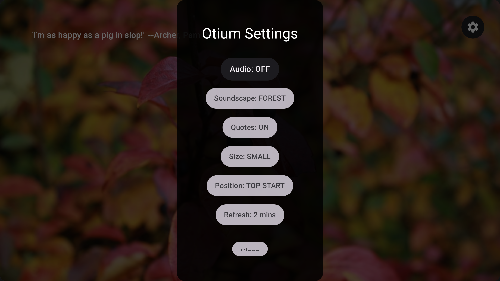

# Otium
  -8E75B2)   

Transform your Android TV into a calming focal point. Otium is an ambient relaxation app designed to bring tranquility to your living space through beautiful nature photography, inspiring quotes, and seamless audio soundscapes.

## Features

* **Dynamic Visuals:** Enjoy a rotating gallery of stunning, high-resolution nature backgrounds powered by the Unsplash API.
* **Inspirational Quotes:** Cultivate mindfulness with curated quotes. You can easily adjust the text size, toggle visibility, and change the screen position to suit your aesthetic.
* **Immersive Soundscapes:** Choose from four gapless audio loops to match your mood: Rain, Waves, Forest, and White Noise.
* **Custom Pacing:** Tailor the experience by adjusting the background refresh interval from 2 up to 5 minutes.
* **Smart Lifecycle Management:** Otium intelligently pauses audio when your TV goes to sleep or switches to another app, resuming seamlessly when you return.

## Installation (Sideloading on Android TV)

Since Otium is currently distributed directly via GitHub, you will need to sideload the app onto your Android TV.

1. Navigate to the **Releases** section on the right side of this repository.
2. Download the latest `app-release.apk` file to your computer or smartphone.
3. Transfer the APK file to your Android TV. You can do this using a USB flash drive or a Wi-Fi transfer app like "Send Files to TV" (available on the Google Play Store for both mobile and TV).
4. On your Android TV, go to **Settings > Device Preferences > Security & Restrictions**.
5. Enable **Unknown Sources** for your chosen file manager app.
6. Open your file manager, locate the downloaded `app-release.apk`, and select it to install.

## 📸


---

## 🏗️ System Architecture

Otium uses a modern Android architecture with a focus on non-blocking I/O and efficient memory management for low-spec TV hardware.

```mermaid
graph TD
    TV[Android TV Device] -->|Lifecycle Events| Audio[ExoPlayer / Media3]
    TV -->|LaunchedEffect| Timer[Dynamic Master Timer]
    
    Timer -->|Request| Unsplash[Unsplash API]
    Timer -->|Request| QuoteAPI[Quote API]
    
    Unsplash -->|Image URL| Coil[Coil Image Loader]
    Coil -->|Prefetch & Cache| Disk[(Local Disk Cache)]
    
    QuoteAPI -->|Quote JSON| State[UI State]
    Disk -->|Instant Load| Screen[AmbientScreen Composable]
    Audio -->|Gapless Playback| Screen
    
    User((User)) -->|D-Pad Select| Settings[Options Dialog]
    Settings -->|Save| DStore[(Jetpack DataStore)]
    
    DStore -->|Observe Preferences| Screen
    DStore -->|Refresh Interval| Timer
    DStore -->|Observe Sound Type| Audio